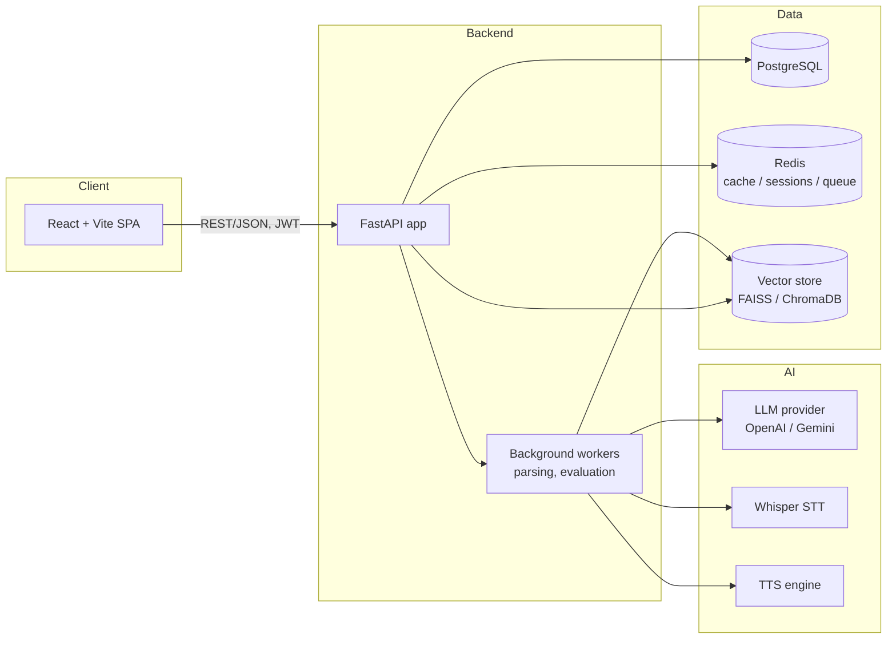

# Architecture & Roadmap

## High-level system



## Repo layout

Monorepo with two independently deployable apps plus shared docs/infra:

```
backend/
  app/
    core/       # settings, security, shared config
    api/v1/     # versioned route modules
    models/     # SQLAlchemy models          (from M2)
    schemas/    # Pydantic request/response  (from M2)
    services/   # business logic             (from M2)
  tests/
frontend/
  src/
    components/ui/   # shadcn/ui primitives
    lib/              # utils, api client
docs/
docker-compose.yml
```

**Why a monorepo:** one project, one contributor (for now), one place to see
the whole system. A shared root also makes `docker-compose.yml` and CI config
simpler than coordinating two repos. If this ever needs independent deploy
cadences or separate teams, splitting later is a straightforward git-history
preserving move.

## Key decisions

- **uv over pip/poetry** — single Rust binary, manages both the Python
  interpreter version and dependencies with a real lockfile (`uv.lock`),
  and is materially faster. It's what more teams are standardizing on.
- **Pinned to Python 3.12, not the newest 3.14** — later milestones pull in
  heavy ML wheels (`torch`, `faiss-cpu`, `sentence-transformers`, `whisper`)
  that typically lag the newest CPython release by many months. 3.12 is the
  safe, well-supported target.
- **Tailwind v4 + shadcn/ui** — shadcn generates owned component source
  (not an npm dependency), so components are fully customizable and there's
  no black-box UI library to fight later.
- **Vite dev proxy (`/api` → `:8000`)** — lets the frontend call relative
  `/api/v1/...` paths in both dev and prod, avoiding hardcoded hosts and CORS
  configuration during local development.
- **FastAPI + SQLAlchemy + PostgreSQL** — async-capable, typed, automatic
  OpenAPI docs; PostgreSQL for relational integrity (users, interviews,
  evaluations), Redis for sessions/caching/queues, a vector store for resume
  and question embeddings (semantic search / RAG).

## Milestone roadmap

| # | Milestone | Outcome |
|---|-----------|---------|
| 1 | **Project setup** *(this session)* | Monorepo scaffold, FastAPI health check, React shell, docker-compose for infra |
| 2 | Backend foundations | SQLAlchemy models, Alembic migrations, layered config, DB session management |
| 3 | Authentication | Register/login, password hashing, JWT access + refresh tokens |
| 4 | Resume ingestion | Upload, storage, PDF/DOCX parsing, structured extraction |
| 5 | Job description + interview plan | JD upload, LLM-generated interview plan tailored to resume + JD |
| 6 | Interview engine core | Conversation state machine, resume-aware question generation |
| 7 | Interview modes | Technical / behavioral / coding differentiation, dynamic follow-ups |
| 8 | Voice interaction | Whisper STT, TTS playback |
| 9 | Interview recording | Session transcripts and audio storage |
| 10 | AI evaluation | Scoring rubric, recruiter-style report generation |
| 11 | Frontend interview UI | Real-time chat/voice interface |
| 12 | Analytics dashboard | Progress tracking, trends over time |
| 13 | Learning roadmap | Personalized improvement plan from evaluation history |
| 14 | Integrations | GitHub profile signal, LeetCode (future) |
| 15 | Deployment & CI/CD | Dockerized deploy, GitHub Actions, hosted environments |

Each milestone is scoped to be completable in one focused session and leaves
the system in a runnable state.
